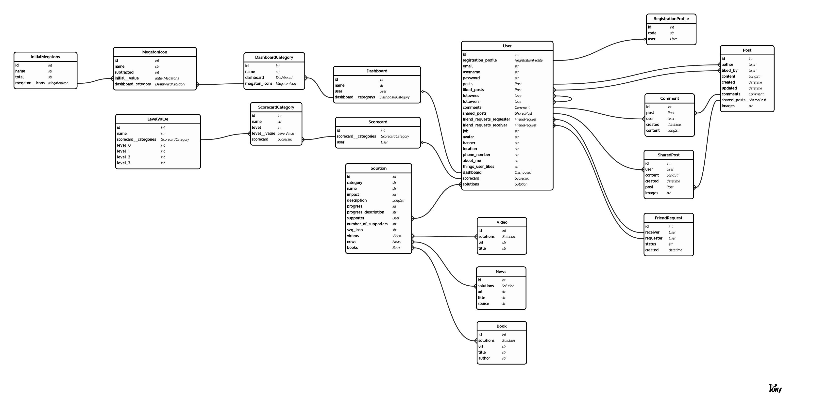

# Climate Cockpit

## Website

[Visit Climate Cockpit](https://climate-cockpit.propulsion-learn.ch/)

## Wireframe

Explore our wireframe on Figma:
[Climate Cockpit Wireframe](https://www.figma.com/file/KMcmmUApmDXahwsdGtfjAA/)

## Object Role Modeling

## Backend API Endpoints

For a comprehensive understanding of our API, refer to our interactive
[Swagger documentation](https://climate-cockpit.propulsion-learn.ch/api/docs/).

### API Endpoints

You can access our API at `https://climate-cockpit.propulsion-learn.ch/api/`.

#### Solutions

- `GET /solutions/list/`: Get a list of all available solutions.
- `GET /solutions/category/`: Get a list of all solution categories.
- `GET /solutions/support/<int:user_id>/`: Get the solutions supported by a
  specific user.
- `GET /solutions/impact/<int:user_id>/`: Get the impact for a specific user.
- `GET /solutions/scorecard/<int:user_id>/`: Get the scorecard for a specific
  user.
- `GET /solutions/dashboard/<int:user_id>/`: Get the dashboard for a specific
  user.

#### Registration

- `POST /auth/registration/`: Register a new user by providing an email (a
  validation code will be sent to the given email).
- `POST /auth/registration/validation/`: Validate the creation of a new user
  with the code sent via email.

#### Authentication

- `POST /auth/token/`: Get a new JWT by sending an email and password.
- `POST /auth/token/refresh/`: Get a new JWT by passing an old still valid
  refresh token.
- `POST /auth/token/verify/`: Verify the validity of a token.
- `POST /auth/password-reset/`: Reset a user’s password by sending a validation
  code in an email.
- `POST /auth/password-reset/validation/`: Validate the password reset token and
  set a new password for the user.

#### Posts

- `POST /social/posts/`: Create a new post by sending post data. Users can also
  share another post.
- `GET /social/posts/`: List all the posts of all users in chronological order.
- `GET /social/posts/?search=<str:search_string>`: Search posts of all users and
  list results in chronological order.
- `GET /social/posts/<int:post_id>/`: Get a specific post by ID and display all
  the information about that post.
- `PATCH /social/posts/<int:post_id>/`: Update a specific post (allowed for the
  owner of the post or an admin).
- `DELETE /social/posts/<int:post_id>/`: Delete a post by ID (allowed for the
  owner of the post or an admin).
- `GET /social/posts/user/<int:user_id>/`: List all the posts of a specific user
  in chronological order.
- `GET /social/posts/following/`: List all the posts of followed users in
  chronological order.
- `GET /social/posts/friends/`: List all the posts of the logged-in user’s
  friends in chronological order.
- `POST /social/posts/toggle-like/<int:post_id>/`: Like/Unlike a post (works as
  a toggle).
- `GET /social/posts/likes/`: List the posts that the logged-in user likes.

#### Comments

- `POST /social/comments/new/<int:post_id>/`: Create a new comment for a post.
- `GET /social/comments/<int:comment_id>/`: Get a comment.
- `DELETE /social/comments/<int:comment_id>/`: Delete a comment.
- `GET /social/comments/<int:post_id>/`: List all comments of a post.

#### Users

- `GET /users/me/`: Get the logged-in user’s profile (including private
  information like email, etc.).
- `PATCH /users/me/`: Update the logged-in user’s profile public info.
- `DELETE /users/me/`: Delete the logged-in user’s profile and all related data
  (posts, comments, likes, etc.).
- `POST /social/followers/toggle-follow/<int:user_id>/`: Toggle follow/unfollow
  a user.
- `GET /social/followers/followers/`: List of all the logged-in user’s
  followers.
- `GET /social/followers/following/`: List of all the people the current
  logged-in user is following.
- `POST /social/friends/request/<int:user_id>/`: Send a friend request to
  another user.
- `GET /social/friends/requests/<int:friend_request_id>/`: Get details of a
  friend request.
- `PATCH /social/friends/requests/<int:friend_request_id>/`: Accept or Reject an
  open friend request (allowed for the recipient of the friend request or an
  admin).
- `DELETE /social/friends/requests/<int:friend_request_id>/`: Delete a friend
  request (allowed for the sender of the friend request or an admin).
- `GET /social/friends/`: List all accepted friends.
- `GET /users/`: Get all the users.
- `GET /users/?search=<str:search_string>`: Search users.
- `GET /users/<int:user_id>/`: Get a specific user’s profile.
